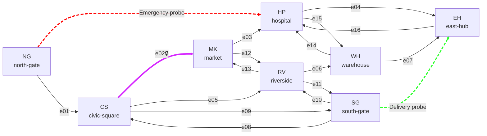

# Central District Graph Reference

This schematic is the M03 reference for the immutable `central-district` catalog. It shows direction only; it is not a rendering layout or a routing result.

### Probes

- **Emergency probe:** `NG → HP`
- **Delivery probe:** `SG → EH`

### Special edge

- **`e02 (civic-square-to-market)`** is the only closable edge.

Paired labels represent two directed edges between the same nodes. The exact direction of each edge is listed in the table below.

> [!NOTE]
> **If Mermaid does not render in a viewer, use the directed-edge table below as the canonical reference.**
## Node IDs

| Short label | Node ID |
| --- | --- |
| `NG` | `north-gate` |
| `CS` | `civic-square` |
| `MK` | `market` |
| `HP` | `hospital` |
| `SG` | `south-gate` |
| `RV` | `riverside` |
| `WH` | `warehouse` |
| `EH` | `east-hub` |

## Directed Edge IDs

| Label | Edge ID | Direction |
| --- | --- | --- |
| `e01` | `north-gate-to-civic-square` | `north-gate` → `civic-square` |
| `e02*` | `civic-square-to-market` | `civic-square` → `market` (closable) |
| `e03` | `market-to-hospital` | `market` → `hospital` |
| `e04` | `hospital-to-east-hub` | `hospital` → `east-hub` |
| `e05` | `civic-square-to-riverside` | `civic-square` → `riverside` |
| `e06` | `riverside-to-warehouse` | `riverside` → `warehouse` |
| `e07` | `warehouse-to-east-hub` | `warehouse` → `east-hub` |
| `e08` | `south-gate-to-civic-square` | `south-gate` → `civic-square` |
| `e09` | `civic-square-to-south-gate` | `civic-square` → `south-gate` |
| `e10` | `south-gate-to-riverside` | `south-gate` → `riverside` |
| `e11` | `riverside-to-south-gate` | `riverside` → `south-gate` |
| `e12` | `market-to-riverside` | `market` → `riverside` |
| `e13` | `riverside-to-market` | `riverside` → `market` |
| `e14` | `warehouse-to-hospital` | `warehouse` → `hospital` |
| `e15` | `hospital-to-warehouse` | `hospital` → `warehouse` |
| `e16` | `east-hub-to-hospital` | `east-hub` → `hospital` |

## Probe Definitions

| Probe | Origin | Destination |
| --- | --- | --- |
| `emergency-access` | `north-gate` | `hospital` |
| `delivery-access` | `south-gate` | `east-hub` |
